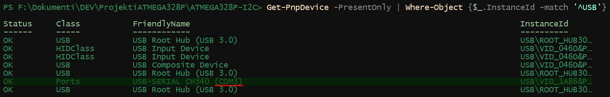
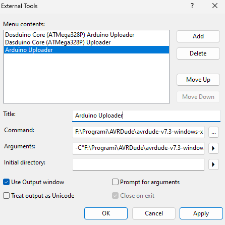
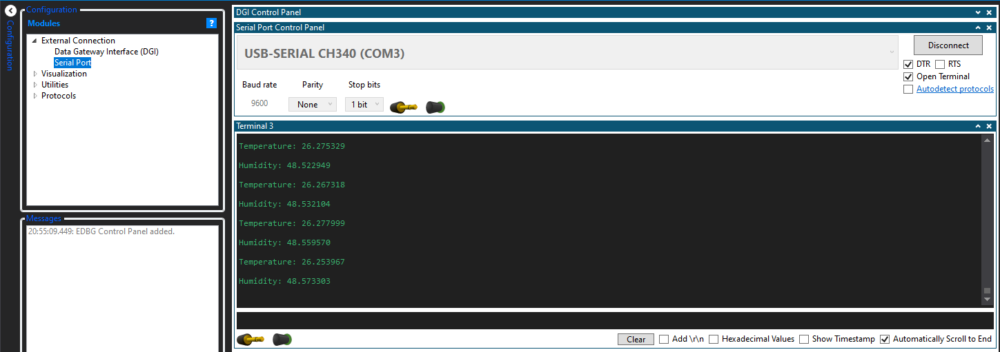

# ATMEGA328P-I2C

This is a simple library to simplify sending multi-byte data over
I2C (or TWI in Atmel's terminology).
This library is written specifically for AVR architecture, and it is
primarily meant to be used for Arduino boards, which use Atmel's ATMega328P
microcontroller.
The library features basic I2C operations for microcontroller as master
device, such as initializing I2C, writing and rading multiple bytes to/from
slave devices.
The library is written in Microchip Studio IDE.
However, it can be built and programmed to ATMega328P from either the
Microchip Studio IDE or Arduino IDE.
Furthermore, this project features test codes and examples for both
Microchip Studio and Arduino IDE, primarily tested on SHTC3 sensor.
Further in text it will be described how to build the I2C code as a standalone
static library, as well as how to build and upload the full example program
to the Arduino board, using either Microchip Studio or Arduino IDE.

## Setup for Microchip Studio

There are two variants of this project to be used with Microchip Studio IDE.
The two variants are located on their respective branches:
- `main`
- `i2c-shtc3-test`

The `main` branch is project variant containing only I2C code,
prepared to be built for a standalone static library,
which can be integrated into other projects.

The `i2c-shtc3-test` branch is project variant, which tests I2C functionality
and can be built as executable program,
which can be then programmed to Arduino board with ATMega328P.
The variant utilizes simple custom made SHTC3 driver library for I2C
communication testing with SHTC3 sensor as slave device.
The variant also utilizes simple custom made SerialPrint library for printing
messages via USART, similarly as Arduino's `serial.print` function.

### Building static library

The steps for building a I2C static library is fairly straightforward.
The building process can be broken down to these steps:
1. `git clone https://github.com/Filip7700/ATMEGA328P-I2C.git`
2. Open Microchip Studio IDE
3. File > Open > Project/Solution
4. Navigate to the location, where the project is cloned
5. Select ATMEGA328P-I2C.atsln, located inside ATMEGA328P-I2C folder
6. Click Open
7. After project loads go to: Build > Build Solution

After building finishes, the static library can be found inside Debug folder,
named libATMEGA328P-I2C.a file.

### Building test executable program

Similarly to building static library, test program building brocess is fairly
straightforward as well.
The building process can be broken down to these steps:
1. `git clone https://github.com/Filip7700/ATMEGA328P-I2C.git`
2. `git checkout i2c-shtc3-test`
3. Open Microchip Studio IDE
4. File > Open > Project/Solution
5. Navigate to the location, where the project is cloned
6. Select ATMEGA328P-I2C.atsln, located inside ATMEGA328P-I2C folder
7. Click Open
8. After project loads go to: Build > Build Solution

After building finishes, the binary executable program can be found inside
Debug folder, named ATMEGA328P-I2C.hex file.

However, unlike Arduino IDE, programming executable file to Arduino board is
not that straightforward.
The further paragraphs explain how to setup to program and test executable
directly from Microchip Studio.

### Programming executable to ATMega328P with Microchip Studio

For successfully programming built executable (ATMEGA328P-I2C.hex) to Arduino
board, external program has to be dowloaded and setup first.
It's called avrdude.
The following steps describe how download and install avrdude:
1. Download avrdude from the [here](https://github.com/avrdudes/avrdude/releases).
2. Extract the archive to any location of choice, let's call it *<avrdude-loc>*

After extracting avrdude and before setting it up on Microchip Studio,
correct USB port needs to be read, so the avrdude knows on what USB port
Arduino board is connected and to upload executable successfully.

The following steps describe how to read USB port,
connected to Arduino on Windows 10 and Windows 11:
1. If not already, connect Arduino board to PC with USB cable
2. Open PowerShell (or WindowsTerminal)
3. Type the following command: `Get-PnpDevice -PresentOnly | Where-Object { $_.InstanceId -match '^USB' }`
4. Command will list all connected USB devices, find device which has COM in its name, something like *USB-SERIAL CH340 (COM3)*
5. Remember the COM part within parentheses and with its number, (e.g. COM3 or COM4), let's call it *<COMx>*

Now, that serial USB port is known, avrdude can be configured in Microchip Studio.

The following steps describe how to setup avrdude for Microchip Studio:
1. Open Microchip Studio IDE
2. Tools > External Tools
3. When External Tools window opens, click **Add** button
4. In title field, enter the any name for programmer (e.g. Arduino Uploader)
5. In **Command** field, enter location of **avrdude.exe** program, located inside *<avrdude-loc>* (e.g. *<avrdude-loc>*\avrdude.exe)
6. In **Arguments** field, enter the following: -C"*<avrdude-loc>*\avrdude.conf" -v -patmega328p -carduino -P*<COMx>* -b57600 -D -Uflash:w:"$(ProjectDir)Debug\$(TargetName).hex":i
7. Check **Use Output window** checkbox

**NOTE:** Don't forget to replace *<avrdude-loc>* to real where avrdude is extracted and *<COMx>* with the real COM port with its number.

Finally, it is possible to upload executable test program to Arduino board.
Just click: Tools > Arduino Uploader

### Using Microchip Studio's Data Visualizer to view program prints

Although it is possible to use Arduino IDE serial monitor, Microchip Studio
has its own tool to view program printed outputs via UART,
called Data Visualizer.
The following steps describe how to open Data Visualizer:
1. Tools > Data Visualizer
2. Expand under **Configuration** section (vertical text on the left)
3. Expand **External Connection**, double click on **Serial Port**
4. From the dropdown menu select COM port connected to Arduino board
5. Set baud rate to 9600
6. Set parity to None
7. Set stop bits to 1 bit
8. Click connect

In terminal the printed values from running program should start appearing.

**NOTE:** Do not change baudrate, parity or stop bits options to any other
value or terminal won't print correctly.
This is because these options are hardcoded to SerialPrint library,
which is only used for I2C testing purposes.
Feel free to tweak and upgrade the SerialPrint library to support more
options.

## Setup for Arduino IDE

This project can be used as library for Arduino.
In order to install library for Arduino IDE, please go to one of the
following branches and download the project as a .zip file:
- `i2c-arduino-lib`
- `i2c-example-shtc3-arduino-lib`

For best ease of use, the branch `i2c-example-shtc3-arduino-lib` is
recomended, because except the I2C driveer itself, it includes working SHTC3
driver, written to test I2C driver functionality.
It includes an example source codes as well.
The branch `i2c-arduino-lib` only includes I2C driver itself.
However it can be used for writing drivers for other devices and sensors,
which use I2C protocol (e.g. LSM6DSO 6-DOF module or RTC PCF85063A).

### Installing the downloaded .zip library

1. Open the Arduino IDE
2. On the menu bar click on the "Sketch" dropdown menu
3. Include Library > Add .ZIP Library
4. Navigate to the location where the project .zip file is downloaded
5. Select and open the .zip file

## Using the ATMEGA328P-I2C library

The library can be included into any C++ header or source file,
using the following line:
`#include <atmega328p_i2c.h>`

After including library, all the I2C functionality is available in the
`ATMega328PI2C` class.

The class can instantiate object with the following constructors:
1. `ATMega328PI2C()`: Default constructor
2. `ATMega328PI2C(const uint32_t)`: Parameterized constructor
3. `ATMega328PI2C(const ATMega328PI2C&)`: Copy constructor

The following methods can be called upon instantiating the class:
1. `int i2c_initialize(const uint32_t)`
2. `int i2c_send(const uint8_t, uint8_t const * const, const unsigned)`
3. `int i2c_receive(const uint8_t, uint8_t *const, const unsigned)`

### Defualt constructor

Initializes an object with default values for its internal attributes,
such as I2C initialisation state, or pseudo timer counter.
I2C initialization state is always initialized to `false`,
because constructor itself does not initialize I2C registers.
For that `i2c_initialize` method is used.
Pseudo timer counter is set to its default value, defined by
`I2C_TIMEOUT_COUNTER_DEFAULT` macro.
For pseudo timer counter `I2C_TIMEOUT_COUNTER_DEFAULT` should be
approximately 1 ms, when ran on ATMega328P.

### Parameterized constrctor

Initializes an object with custom pseudo timer counter,
in case one wishes to make waiting time for slave device response
longer or shorter.
It takes one input parameter, `timeout_counter`.

### Copy constructor

Initializes an object by copying internal attributes of passed
`ATMega328PI2C` object.
It takes one input parameter reference, `other`.

### Method i2c_initialize

Initializes the I2C clock and registers, i.e. I2C bit rate register (TWBR)
and I2C status register (TWSR).
The funciton takes one input parameter, `i2c_clock_frequency`,
which is desired I2C clock frequency.
One of the following frequencies, defined by I2C standard,
must be passed to function:
- `I2C_STANDARD_MODE_FREQUENCY_HZ` (or 100000)
- `I2C_FAST_MODE_FREQUENCY_HZ` (or 400000)
- `I2C_FAST_MODE_PLUS_FREQUENCY_HZ` (or 1000000)
- `I2C_HI_SPEED_MODE_FREQUENCY_HZ` (or 1700000)
- `I2C_HI_SPEED_MODE_PLUS_FREQUENCY_HZ` (or 3400000)
- `I2C_ULTRA_FAST_MODE_FREQUENCY_HZ` (or 5000000)

In case that any other bogus value is provided to the method as
an input parameter, I2C registers will not be initialized,
and `I2C_RET_NOT_INITIALIZED` error code is returned.
Otherwise `I2C_RET_OK` is returned.

This function must be called first, before doing anything else with I2C.
Therefore, it is reasonable to call this function within `void setup()`
function in Arduino IDE, or before main program loop in `int main()` function.

### Method i2c_send

Writes array of bytes of arbitrary size to slave device.
The method accepts three parameters:
- `target_address` Input parameter. Slave target 7-bit I2C address.
- `buffer`: Input parameter. Pointer to byte buffer, which will be written to target slave device.
- `buffer_size`: Input prameter. Buffer size, i.e. number of bytes in buffer, which will be written to target slave device.

After address or any byte from buffer is sent to the slave,
method waits to receive acknowledge bit from slave for certain time,
defined by timer counter.
In case the timer counter reaches its maximum value
(which is defined upon `ATMega328PI2C` object instantiation)
the `I2C_RET_TIMEOUT` error code is returned.
Furthermore, in case that one forgets to call `i2c_initialize` and I2C
remains uninitialized, `I2C_RET_NOT_INITIALIZED` error code is returned.
More to that, in case that buffer is `NULL` pointer or buffer size is 0,
`I2C_RET_INVALID_BUFFER` error code is returned.
Otherwise, if acknowledge bit is received before timer expiry,
and I2C is properly initialized and buffer is properly allocated `I2C_RET_OK`
value is returned.

### Method i2c_receive

Reads bytes of slave device, and stores it in byte buffer.
The function accepts three parameters:
- `target_address`: Input parameter. Slave target 7-bit I2C address.
- `buffer`: Output parameter. Pointer tp byte buffer, which will store read bytes from the slave.
- `buffer_size`: Input parameter. Buffer size, i.e. expected number of bytes in buffer, which will store data from slave.

After address is sent to the slave,
method waits to receive acknowledge bit from slave for certain time,
defined by timer counter.
Furthermore, method waits for every byte reception from slave for certain
time, defined by the mentioned timer counter.
In case the timer counter reaches its maximum value
(which is defined upon `ATMega328PI2C` object instantiation)
the `I2C_RET_TIMEOUT` error code is returned.
Furthermore, in case that one forgets to call `i2c_initialize` and I2C
remains uninitialized, `I2C_RET_NOT_INITIALIZED` error code is returned.
More to that, in case that buffer is `NULL` pointer or buffer size is 0,
`I2C_RET_INVALID_BUFFER` error code is returned.
Otherwise, if acknowledge bit is received before timer expiry,
and I2C is properly initialized and buffer is properly allocated `I2C_RET_OK`
value is returned.
